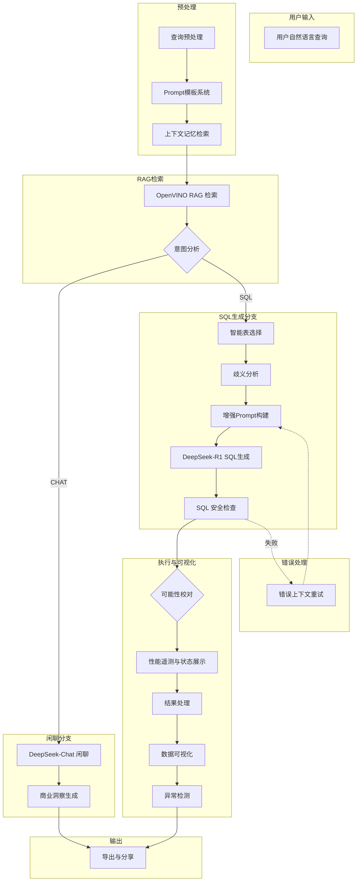

# Intel® DeepInsight 系统架构说明

> 基于 OpenVINO™ 的智能零售决策系统 - 自然语言数据分析平台

---

## 📋 目录

- [系统概述](#系统概述)
- [整体架构](#整体架构)
- [核心模块详解](#核心模块详解)
- [工作流程](#工作流程)
- [技术栈](#技术栈)
- [目录结构](#目录结构)
- [数据流向](#数据流向)
- [扩展指南](#扩展指南)

---

## 系统概述

Intel® DeepInsight 是一个基于 **OpenVINO™ 加速**的智能零售决策系统，采用 **Text-to-SQL** 技术将用户的自然语言查询转换为 SQL 语句，并提供智能数据可视化和商业洞察分析。

### 核心特性

| 特性 | 描述 |
|------|------|
| 🗣️ **自然语言交互** | 支持中英文自然语言查询，无需 SQL 知识 |
| 🔍 **RAG 语义检索** | 基于 OpenVINO 优化的 BGE 模型进行语义理解 |
| 📊 **智能可视化** | 自动选择最佳图表类型，支持交互式探索 |
| 🧠 **上下文记忆** | 多轮对话支持，理解查询历史和业务上下文 |
| ⚡ **硬件加速** | 自动检测并利用 Intel CPU/GPU 进行优化 |
| 🔒 **安全优先** | 仅允许只读查询（SELECT/WITH/EXPLAIN/SHOW/DESCRIBE），防止数据篡改 |

### 系统定位

```
用户自然语言输入 → Text-to-SQL Agent → 数据库查询执行 → 智能可视化 → 商业洞察报告
```

---

## 整体架构

系统采用**六层分层架构**设计，从上到下分别为：

```
┌─────────────────────────────────────────────────────────────────┐
│                    🖥️ 前端交互层 (Streamlit Web UI)              │
│  ┌─────────┬───────────┬───────────┬──────────┬──────────────┐  │
│  │自然语言  │ 实时性能   │ 上下文记忆 │ Prompt   │ 一键报告导出 │  │
│  │对话界面  │ 资源监控   │ 管理      │ 词典配置  │             │  │
│  └─────────┴───────────┴───────────┴──────────┴──────────────┘  │
├─────────────────────────────────────────────────────────────────┤
│                      🔧 核心业务层                               │
│  ┌─────────────┬───────────────┬─────────────┬───────────────┐  │
│  │ Text2SQL    │ 智能表选择器   │ 查询歧义    │ 错误上下文     │  │
│  │ Agent       │ (语义匹配)     │ 分析器      │ 重试机制       │  │
│  └─────────────┴───────────────┴─────────────┴───────────────┘  │
├─────────────────────────────────────────────────────────────────┤
│                    🤖 AI 推理层 (LLM API & RAG)                  │
│  ┌──────────────┬───────────────┬─────────────────────────────┐ │
│  │ LLM 接入接口  │ IntelRAG 向量 │ 模型调度与缓存              │ │
│  │(DeepSeek/    │ 检索 (OpenVINO│ (Latency < 100ms)           │ │
│  │ Qwen/Ollama) │ bge-small-ov) │                             │ │
│  └──────────────┴───────────────┴─────────────────────────────┘ │
├─────────────────────────────────────────────────────────────────┤
│                 📈 数据处理与可视化层                            │
│  ┌─────────────┬───────────────┬─────────────┬───────────────┐  │
│  │ 鲁棒可视化   │ 异常检测与    │ 智能推荐    │ 多格式报告    │  │
│  │ 引擎        │ 根因分析      │ 引擎        │ 导出管理器    │  │
│  └─────────────┴───────────────┴─────────────┴───────────────┘  │
├─────────────────────────────────────────────────────────────────┤
│                ⚡ 硬件优化层 (Intel® Architecture Optimized)     │
│  ┌─────────────────────────┬───────────────────────────────────┐│
│  │ Intel CPU 专项优化       │ Intel GPU/NPU 加速               ││
│  │ (AVX-512 / MKL)          │ (OpenVINO Runtime)               ││
│  ├─────────────────────────┴───────────────────────────────────┤│
│  │         跨平台兼容模式 (AMD/NVIDIA 自动降级)                 ││
│  └──────────────────────────────────────────────────────────────┘│
├─────────────────────────────────────────────────────────────────┤
│                       💾 数据存储层                              │
│  ┌─────────────┬───────────────────────────┬──────────────────┐ │
│  │ 本地 SQLite  │ 企业级 MySQL / PostgreSQL  │ 数据源文件      │ │
│  │             │                           │ (Parquet / CSV)  │ │
│  └─────────────┴───────────────────────────┴──────────────────┘ │
└─────────────────────────────────────────────────────────────────┘
```

---

## 核心模块详解

### 1. Agent 核心 (`agent_core.py`)

**职责**: 整个系统的核心控制器，协调 RAG 检索、LLM 推理、SQL 执行及结果解释的全流程。

**核心类**: `Text2SQLAgent`

```
主要功能:
├── analyze_intent()         # 意图分析（SQL查询 vs 闲聊）
├── generate_and_execute_stream()  # 核心主流程（流式输出）
├── execute_sql()            # SQL 安全执行
├── retrieve_context_two_stage()  # 二阶段检索编排入口（Agent层）
├── _apply_self_healing()    # SQL 错误自愈（上下文增强与Schema补全）
├── generate_sql_for_possibility()  # 歧义多可能性 SQL 生成
└── generate_insight_stream()  # 商业洞察生成
```

**关键特性**:
- 支持 **Reasoner 可选切换**（由 `use_reasoner_for_healing` 配置控制）
- 集成**错误上下文重试机制**，基于错误上下文增强的配置化重试与策略修复。
- 严格的 **SQL 安全检查**（仅允许只读查询）

---

### 2. RAG 检索引擎 (`rag_engine.py`)

**职责**: 基于 OpenVINO 优化的 **二阶段混合检索**，为 SQL 生成提供精准 Schema 上下文。

**核心类**: `IntelRAG`

```
主要功能:
├── __init__()               # 加载 OpenVINO 优化的 BGE 模型
├── _get_embedding()         # 文本向量化
├── _build_knowledge_base()  # 构建向量知识库（Schema + 文档）
├── retrieve()               # 语义检索（返回 Top-K 相关内容）
├── _llm_pruning()           # 🆕 LLM 语义精排（当前实现 3-6 核心表）
├── _complete_table_dependencies()  # 🆕 外键依赖自动补全
└── retrieve_context()       # 二阶段检索执行入口（RAG层）
```

**二阶段检索流程**:
```
粗排 (向量检索)
    ↓ Top-12 候选表
LLM 语义精排
    ↓ 3-6 核心表
外键依赖补全
    ↓ 最终 ≤8 表
```

**性能指标**:
- 模型: `bge-small-zh-v1.5` (OpenVINO FP16 优化版)
- 嵌入维度: 512
- 延迟目标: `< 100ms`
- Token 节省: ~85% (相比全量 Schema)

---

### 3. 智能表选择器 (`table_selector.py`)

**职责**: 动态加载用户上传的 Schema，使用语义匹配进行智能表选择。

**核心类**: `IntelligentTableSelector`

```
主要功能:
├── load_dynamic_schema()        # 动态加载 Schema 文件
├── precompute_embeddings()      # 预计算向量表示
├── calculate_semantic_similarity()  # 语义相似度计算
├── select_tables()              # 智能表选择（Top-K）
└── get_table_context()          # 生成表上下文信息
```

**评分机制**:
- 语义相似度 (0.50 权重)
- 关键词匹配 (0.30 权重，带上限截断)
- 列匹配度 (0.20 权重，带上限截断)

---

### 4. Prompt 模板系统 (`prompt_template_system.py`)

**职责**: 管理多 LLM 提供商支持的 Prompt 模板，可自定义业务上下文和术语词典。

**核心类**: `PromptTemplateManager`

```
主要功能:
├── get_system_instruction()     # 获取系统指令
├── get_business_context_section()  # 业务上下文注入
├── get_example_queries_section()   # 示例查询匹配（jieba 分词）
└── add_term() / update_term()   # 术语词典管理
```

**模式支持**:
- `PROFESSIONAL`: 严格 SQL 生成模式
- `FLEXIBLE`: 灵活自然语言推理模式

**LLM 提供商**:
- DeepSeek
- OpenAI
- Claude
- Qwen
- 自定义 API

---

### 5. 查询可能性生成器 (`query_possibility_generator.py`)

**职责**: 分析中文查询的歧义，生成多种可能的理解方式和对应 SQL。

**核心类**: `QueryPossibilityGenerator`

```
主要功能:
├── analyze_dimensions()         # 维度分析（时间、地域、产品等）
├── analyze_metrics()            # 指标分析（销售额、利润等）
├── analyze_aggregations()       # 聚合方式分析
├── analyze_filters()            # 筛选条件分析
└── generate_possibilities()     # 生成所有可能性组合
```

---

### 6. 可视化引擎 (`visualization_engine.py`)

**职责**: 基于 Plotly 的智能图表生成，支持多层降级策略确保始终生成有效图表。

**核心类**: `RobustVisualizationEngine`

```
主要功能:
├── analyze_dataframe()          # 深度数据分析
├── create_robust_chart()        # 鲁棒图表创建（主入口）
├── _create_smart_mapping()      # 智能图表映射
└── create_interactive_chart()   # 交互式图表支持
```

**图表类型决策**:
- 时序数据 → 折线图
- 分类对比 → 柱状图
- 比例分布 → 饼图
- 多维关系 → 散点图

---

### 7. 异常检测器 (`anomaly_detector.py`)

**职责**: 自动识别数据异常、趋势变化和业务风险点。

**核心类**: `AnomalyDetector`

```
检测类型:
├── detect_statistical_anomalies()  # 统计异常（Z-score, IQR）
├── detect_business_anomalies()     # 业务异常（负利润、异常折扣）
└── detect_trend_anomalies()        # 趋势异常（突变点、下降趋势）
```

---

### 8. 上下文记忆系统 (`context_memory/`)

**职责**: 支持多轮对话，维护会话上下文和历史记录。

**模块组成**:

| 文件 | 职责 |
|------|------|
| `context_manager.py` | 上下文管理器（协调整个系统） |
| `memory_store.py` | 持久化存储（SQLite） |
| `context_filter.py` | 上下文过滤与相关性排序 |
| `prompt_builder.py` | 构建带上下文的 Prompt |
| `models.py` | 数据模型定义 |

---

### 9. 硬件优化器 (`hardware/`)

**职责**: 通用硬件检测与优化，支持 Intel、NVIDIA、AMD 多种平台。

**核心类**: `UniversalHardwareOptimizer`

```
主要功能:
├── _detect_hardware()           # 硬件信息检测
├── get_cached_result()          # LRU 缓存读取
├── set_cached_result()          # LRU 缓存写入
├── generate_cache_key()         # MD5 缓存键生成
├── optimize_query_performance() # 性能状态预估探测器
└── record_execution_time()      # 性能记录
```

**核心特性**:
- 基于 MD5 与 TTL 的极速内存查询缓存
- 基于硬件特征的前端性能遥测与预估面板
- LRU 缓存淘汰策略（最多 100 条，5 分钟 TTL）
- 跨平台硬件检测（Intel / NVIDIA / AMD）

---

### 10. 导出管理器 (`export_manager.py`)

**职责**: 支持 PDF 报告生成、DOCX 文档导出和数据导出功能。

**核心类**: `ExportManager`

```
导出格式:
├── export_session_to_pdf()      # PDF 完整报告
├── export_session_to_docx()     # DOCX 文档
├── export_data_to_excel()       # Excel 数据导出
└── export_data_to_csv()         # CSV 数据导出
```

---

## 工作流程

### 主查询流程



### 表选择流程

```
用户查询
    ↓
RAG 语义检索 (IntelRAG.retrieve)
    ↓
预筛选候选表 (TableSelector.select_tables)
    ↓
LLM 精排 + 外键依赖补全 (RAG 两阶段检索)
    ↓
生成 Schema 上下文
```

### 错误重试流程（Agent 自愈机制）

```
SQL 执行失败
    ↓
ErrorCollector 收集错误信息
    ↓
ErrorContextManager 分类错误
  ├── 表不存在 → 模糊匹配 + Schema 补全
  ├── 列不存在 → 候选列推荐
  └── 语法错误 → CTE 修复 + 错误上下文
    ↓
PromptEnhancer 增强重试 Prompt
    ↓
LLM 重新生成 SQL (重试上限由配置控制，评测常用 4 次)
  └── 可选启用 Reasoner 模型深度推理
```

---

## 技术栈

### 核心框架

| 技术 | 用途 | 版本 |
|------|------|------|
| Python | 主要开发语言 | 3.10+ |
| Streamlit | Web UI 框架 | 1.25+ |
| OpenVINO | AI 推理加速 | 2024.0+ |
| SQLAlchemy | 数据库 ORM | 2.0+ |

### AI / 机器学习

| 技术 | 用途 |
|------|------|
| OpenAI API | LLM 推理接口 |
| DeepSeek API | 主要 LLM 提供商 |
| Transformers | 模型加载 |
| Optimum Intel | OpenVINO 模型优化 |

### 数据处理

| 技术 | 用途 |
|------|------|
| Pandas | 数据处理 |
| NumPy | 数值计算 |
| Plotly | 交互式可视化 |
| jieba | 中文分词 |

### 报告生成

| 技术 | 用途 |
|------|------|
| ReportLab | PDF 生成 |
| python-docx | DOCX 生成 |
| openpyxl | Excel 导出 |

---

## 目录结构

```
DeepInsight-OpenVINO/
│
├── 📄 app.py                      # Streamlit 主应用入口 (129KB)
├── 📄 agent_core.py               # Text2SQLAgent 核心逻辑 (54KB)
├── 📄 prompt_template_system.py   # Prompt模板管理系统 (40KB)
├── 📄 visualization_engine.py     # 鲁棒可视化引擎 (68KB)
├── 📄 rag_engine.py               # OpenVINO RAG 引擎 (10KB)
├── 📄 anomaly_detector.py         # 异常检测系统 (45KB)
├── 📄 table_selector.py           # 智能表选择器 (17KB)
├── 📄 export_manager.py           # 导出管理器 (58KB)
├── 📄 query_possibility_generator.py  # 查询歧义分析 (18KB)
├── 📄 recommendation_engine.py    # 智能推荐引擎 (11KB)
├── 📄 error_context_system.py     # 错误上下文重试系统 (21KB)
├── 📄 context_memory_integration.py  # 上下文记忆集成 (19KB)
├── 📄 data_filter.py              # 数据过滤工具 (14KB)
├── 📄 performance_monitor.py      # 性能监控 (11KB)
├── 📄 prompt_config_ui.py         # Prompt配置UI (32KB)
├── 📄 chart_key_utils.py          # 图表键值工具 (12KB)
├── 📄 test_mysql_connection.py    # MySQL连接测试 (8KB)
├── 📄 utils.py                    # 通用工具函数 (5KB)
│
├── 📁 hardware/                   # ⚡ 硬件优化模块
│   ├── __init__.py               # 统一导出接口
│   └── universal_hardware_optimizer.py  # 通用硬件优化器 (44KB)
│
├── 📁 ui/                         # 🖥️ UI组件
│   ├── __init__.py
│   ├── style_loader.py           # 样式加载器
│   ├── styles/
│   │   ├── main.css              # 主样式表
│   │   └── scripts.js            # 交互脚本
│   └── panels/
│       ├── __init__.py
│       └── context_memory.py     # 上下文记忆面板
│
├── 📁 context_memory/             # 🧠 上下文记忆系统
│   ├── __init__.py
│   ├── context_manager.py        # 上下文管理器 (38KB)
│   ├── memory_store.py           # 持久化存储 (22KB)
│   ├── context_filter.py         # 上下文过滤器 (15KB)
│   ├── prompt_builder.py         # Prompt构建器 (12KB)
│   └── models.py                 # 数据模型 (5KB)
│
├── 📁 tools/                      # 🔧 工具脚本
│   ├── benchmark_openvino.py     # OpenVINO 性能测试
│   ├── setup_northwind.py        # 示例数据库安装
│   ├── etl_pipeline.py           # 数据 ETL 管道
│   └── optimize_model.py         # 模型优化工具
│
├── 📁 models/                     # 🤖 AI模型
│   └── bge-small-ov/             # OpenVINO 优化的 BGE 嵌入模型
│
├── 📁 data/                       # 💾 数据文件
│   ├── prompt_config.json        # Prompt 配置
│   ├── term_dictionary.csv       # 术语词典
│   ├── example_queries.json      # 示例查询
│   ├── schema/                   # Schema 定义文件
│   └── exports/                  # 导出文件
│
├── 📁 fonts/                      # 🔤 字体文件
│   ├── setup_fonts.py            # 字体安装脚本 (4KB)
│   └── README.md                 # 字体使用说明
│
├── 📁 assets/                     # 📊 资源文件
│   ├── 整体架构图.png
│   ├── 工作流程图.png
│   ├── 功能架构图.png
│   ├── 功能模块.png
│   ├── 核心技术组件.png
│   ├── 团队Logo.png
│   └── intel.svg
│
├── 📁 docs/                       # 📚 文档
│   ├── ARCHITECTURE.md           # 系统架构说明 (本文档)
│   ├── refactoring_checklist.md  # 重构清单
│   └── 硬件优化技术文档.md        # 硬件优化技术说明
│
├── 📄 requirements.txt            # 依赖列表
├── 📄 README.md                   # 项目说明
├── 📄 LICENSE                     # 开源协议
└── 📄 .env                        # 环境变量配置
```

---

## 数据流向

### Schema 加载流程

```
用户上传 Schema JSON 文件
         ↓
    TableSelector.load_dynamic_schema()
         ↓
    RAG.build_knowledge_base()
         ↓
    预计算向量嵌入
         ↓
    存储到内存向量库
```

### 查询执行流程

```
用户查询 → Prompt构建 → RAG检索 → LLM推理 → SQL生成
                                              ↓
导出报告 ← 异常分析 ← 可视化生成 ← 结果处理 ← SQL执行
```

### 上下文更新流程

```
查询完成
    ↓
提取关键实体和意图
    ↓
ContextManager.update_context()
    ↓
MemoryStore 持久化到 SQLite
    ↓
下次查询时自动注入上下文
```

---

## 扩展指南

### 添加新的 LLM 提供商

1. 在 `prompt_template_system.py` 的 `LLMProvider` 枚举中添加新提供商
2. 在 `_get_llm_specific_instruction()` 中添加特定指令
3. 在 `agent_core.py` 中的 `create_openai_client_safe()` 添加客户端创建逻辑

### 添加新的数据库类型

1. 在 `agent_core.py` 的 `_init_db_connection()` 中添加连接字符串解析
2. 根据需要调整 `_is_safe_query()` 中的安全检查逻辑

### 自定义可视化图表

1. 在 `visualization_engine.py` 的 `RobustVisualizationEngine` 中添加新图表类型
2. 在 `_create_smart_mapping()` 中添加图表选择逻辑

### 添加新的异常检测规则

1. 在 `anomaly_detector.py` 中的对应方法中添加检测逻辑
2. 更新 `ANOMALY_TYPES` 字典添加新的类型名称

---

## 架构设计原则

1. **分层解耦**: 各层职责明确，通过接口交互
2. **优雅降级**: 硬件加速失败时自动降级到 CPU 模式
3. **安全优先**: 严格的 SQL 安全检查，仅允许只读查询
4. **性能监控**: 全链路性能指标收集和展示
5. **错误自愈**: 智能错误重试机制，自动学习修复

---

## 版本历史

| 版本 | 日期 | 主要变更 |
|------|------|----------|
| v2.1 | 2026-02-09 | 二阶段 RAG 检索优化、Agent 自愈增强、评测系统建设 |
| v2.0 | 2026-02-04 | 完成六阶段重构 (样式分离、模块整合、硬件优化) |
| v1.0 | 2026-01 | 初始版本发布 |

---

## 相关文档

- [实验设计文档](./实验设计文档.md) - G1-G3 对比实验的科学设计
- [系统重构优化日志](./系统重构优化日志.md) - 2月2日-9日的优化记录

---

*文档更新日期: 2026年2月9日*
